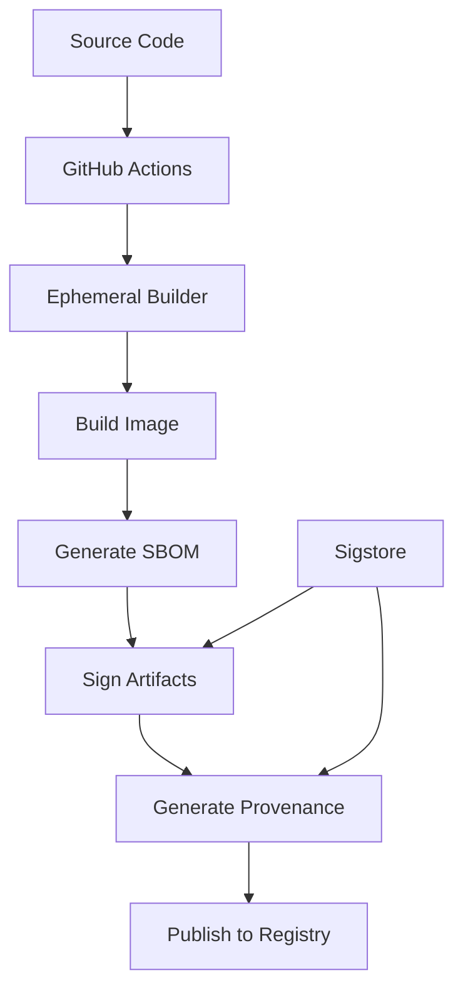

# Build Provenance

Build provenance provides a cryptographically signed record of how a software artifact was built, including the source code, build environment, and build process. Chainguard Images include comprehensive provenance attestations for complete supply chain transparency.

## What is Build Provenance?

Provenance is like a "birth certificate" for software that answers:

- 📝 **What** was built (source code, dependencies)
- 🏠 **Where** it was built (build environment, infrastructure)
- 🔄 **How** it was built (build process, tools used)
- 🕑 **When** it was built (timestamps, duration)
- 👥 **Who** built it (identity, authorization)

## Why Provenance Matters

### Supply Chain Security
- **Tampering Detection**: Verify artifacts haven't been modified
- **Source Verification**: Confirm code comes from trusted repositories
- **Build Integrity**: Ensure builds follow expected processes
- **Compliance**: Meet regulatory and security requirements

### Benefits for Organizations
- ✅ **Risk Reduction**: Identify and mitigate supply chain risks
- ✅ **Incident Response**: Quickly trace affected components
- ✅ **Audit Compliance**: Meet SOC 2, ISO 27001, and other standards
- ✅ **Trust Verification**: Validate software authenticity

## SLSA Framework

Chainguard Images follow the [SLSA (Supply-chain Levels for Software Artifacts)](https://slsa.dev/) framework:

### SLSA Levels

| Level | Requirements | Chainguard Status |
|-------|-------------|-------------------|
| **SLSA 0** | No guarantees | ✅ Exceeded |
| **SLSA 1** | Build process documented | ✅ Exceeded |
| **SLSA 2** | Tamper-resistant build service | ✅ Exceeded |
| **SLSA 3** | Build integrity guarantees | ✅ **Achieved** |
| **SLSA 4** | Highest level assurance | 🔄 In progress |

### SLSA 3 Requirements Met

✅ **Source integrity**: All source code tracked in version control  
✅ **Build service**: Builds run on hardened, isolated infrastructure  
✅ **Build integrity**: Build process is tamper-resistant  
✅ **Provenance available**: Cryptographically signed attestations  
✅ **Provenance authenticated**: Verifiable with public keys  

## Provenance Format

We use the [in-toto attestation format](https://github.com/in-toto/attestation) with SLSA provenance predicates:

```json
{
  "_type": "https://in-toto.io/Statement/v0.1",
  "subject": [{
    "name": "cgr.dev/chainguard/node",
    "digest": {
      "sha256": "abc123..."
    }
  }],
  "predicateType": "https://slsa.dev/provenance/v0.2",
  "predicate": {
    "builder": {
      "id": "https://github.com/chainguard-images/images/.github/workflows/build.yaml@refs/heads/main"
    },
    "buildType": "https://github.com/Attestations/GitHubActionsWorkflow@v1",
    "invocation": {
      "configSource": {
        "uri": "git+https://github.com/chainguard-images/images@refs/heads/main",
        "digest": {
          "sha1": "def456..."
        }
      }
    },
    "materials": [
      {
        "uri": "git+https://github.com/chainguard-images/images@refs/heads/main",
        "digest": {
          "sha1": "def456..."
        }
      }
    ]
  }
}
```

## Accessing Provenance

### Using Cosign

```bash
# Install cosign
go install github.com/sigstore/cosign/v2/cmd/cosign@latest

# Download provenance attestation
cosign download attestation cgr.dev/chainguard/node:latest \
  --predicate-type https://slsa.dev/provenance/v0.2 > provenance.json

# Verify the attestation
cosign verify-attestation cgr.dev/chainguard/node:latest \
  --type slsaprovenance \
  --certificate-identity-regexp "https://github.com/chainguard-images/images" \
  --certificate-oidc-issuer "https://token.actions.githubusercontent.com"
```

### Using SLSA Verifier

```bash
# Install slsa-verifier
go install github.com/slsa-framework/slsa-verifier/v2/cli/slsa-verifier@latest

# Verify provenance
slsa-verifier verify-image cgr.dev/chainguard/node:latest \
  --source-uri github.com/chainguard-images/images
```

### Programmatic Access

```python
#!/usr/bin/env python3
import json
import subprocess
from datetime import datetime

def get_provenance(image):
    """Download and parse provenance attestation"""
    
    # Download provenance
    result = subprocess.run([
        'cosign', 'download', 'attestation', image,
        '--predicate-type', 'https://slsa.dev/provenance/v0.2'
    ], capture_output=True, text=True)
    
    if result.returncode != 0:
        raise Exception(f"Failed to download provenance: {result.stderr}")
    
    # Parse attestation
    attestation = json.loads(result.stdout)
    predicate = json.loads(attestation['payload'])['predicate']
    
    return {
        'builder_id': predicate['builder']['id'],
        'build_type': predicate['buildType'],
        'source_uri': predicate['invocation']['configSource']['uri'],
        'source_commit': predicate['invocation']['configSource']['digest']['sha1'],
        'materials': predicate['materials'],
        'metadata': predicate.get('metadata', {})
    }

# Usage
provenance = get_provenance('cgr.dev/chainguard/node:latest')
print(json.dumps(provenance, indent=2))
```

## Build Environment Details

### Infrastructure Security

Our build infrastructure provides:

- 🛡️ **Isolated Builds**: Each build runs in a fresh, ephemeral environment
- 🔐 **Cryptographic Signing**: All artifacts signed with ephemeral keys
- 📋 **Audit Logging**: Complete logs of all build activities
- 🔄 **Reproducible Builds**: Deterministic build processes

### Build Process



### Build Metadata

Each build includes detailed metadata:

```json
{
  "buildInvocationId": "1234567890",
  "buildStartedOn": "2024-01-15T10:30:00Z",
  "buildFinishedOn": "2024-01-15T10:35:00Z",
  "completeness": {
    "parameters": true,
    "environment": true,
    "materials": true
  },
  "reproducible": true
}
```

## Verification Examples

### Basic Verification

```bash
#!/bin/bash
# Basic provenance verification script

IMAGE="cgr.dev/chainguard/node:latest"
SOURCE_REPO="github.com/chainguard-images/images"

echo "Verifying provenance for $IMAGE..."

# Method 1: Using slsa-verifier (recommended)
if command -v slsa-verifier &> /dev/null; then
    echo "Using slsa-verifier..."
    slsa-verifier verify-image "$IMAGE" --source-uri "$SOURCE_REPO"
    if [ $? -eq 0 ]; then
        echo "✅ Provenance verified successfully"
    else
        echo "❌ Provenance verification failed"
        exit 1
    fi
else
    echo "slsa-verifier not found, using cosign..."
    
    # Method 2: Using cosign
    cosign verify-attestation "$IMAGE" \
        --type slsaprovenance \
        --certificate-identity-regexp "https://github.com/chainguard-images/images" \
        --certificate-oidc-issuer "https://token.actions.githubusercontent.com"
    
    if [ $? -eq 0 ]; then
        echo "✅ Attestation verified successfully"
    else
        echo "❌ Attestation verification failed"
        exit 1
    fi
fi
```

### Advanced Verification

```python
#!/usr/bin/env python3
"""
Advanced provenance verification with custom policies
"""

import json
import subprocess
from datetime import datetime, timezone
from urllib.parse import urlparse

class ProvenanceVerifier:
    def __init__(self, image):
        self.image = image
        self.provenance = None
        
    def download_provenance(self):
        """Download provenance attestation"""
        result = subprocess.run([
            'cosign', 'download', 'attestation', self.image,
            '--predicate-type', 'https://slsa.dev/provenance/v0.2'
        ], capture_output=True, text=True)
        
        if result.returncode != 0:
            raise Exception(f"Failed to download: {result.stderr}")
            
        attestation = json.loads(result.stdout)
        self.provenance = json.loads(attestation['payload'])['predicate']
        
    def verify_builder_identity(self, expected_builder):
        """Verify builder identity"""
        builder_id = self.provenance['builder']['id']
        if expected_builder not in builder_id:
            raise Exception(f"Unexpected builder: {builder_id}")
            
    def verify_source_repository(self, expected_repo):
        """Verify source repository"""
        source_uri = self.provenance['invocation']['configSource']['uri']
        parsed = urlparse(source_uri)
        repo_path = parsed.path.lstrip('/')
        
        if expected_repo not in repo_path:
            raise Exception(f"Unexpected source repo: {repo_path}")
            
    def verify_build_freshness(self, max_age_hours=24):
        """Verify build is recent"""
        if 'metadata' not in self.provenance:
            raise Exception("No build metadata found")
            
        build_time_str = self.provenance['metadata'].get('buildFinishedOn')
        if not build_time_str:
            raise Exception("No build finish time found")
            
        build_time = datetime.fromisoformat(build_time_str.replace('Z', '+00:00'))
        now = datetime.now(timezone.utc)
        age = (now - build_time).total_seconds() / 3600
        
        if age > max_age_hours:
            raise Exception(f"Build too old: {age:.1f} hours")
            
    def verify_reproducibility(self):
        """Verify build is marked as reproducible"""
        if 'metadata' not in self.provenance:
            raise Exception("No build metadata found")
            
        reproducible = self.provenance['metadata'].get('reproducible')
        if not reproducible:
            raise Exception("Build is not marked as reproducible")
            
    def verify_all(self, expected_repo, expected_builder=None):
        """Run all verification checks"""
        self.download_provenance()
        
        if expected_builder:
            self.verify_builder_identity(expected_builder)
            
        self.verify_source_repository(expected_repo)
        self.verify_build_freshness()
        self.verify_reproducibility()
        
        return True

# Usage
if __name__ == "__main__":
    verifier = ProvenanceVerifier('cgr.dev/chainguard/node:latest')
    
    try:
        verifier.verify_all(
            expected_repo='chainguard-images/images',
            expected_builder='github.com/chainguard-images/images'
        )
        print("✅ All provenance checks passed")
    except Exception as e:
        print(f"❌ Provenance verification failed: {e}")
        exit(1)
```

## Policy Enforcement

### Admission Controllers (Kubernetes)

```yaml
# Example using Sigstore Policy Controller
apiVersion: config.sigstore.dev/v1alpha1
kind: ClusterImagePolicy
metadata:
  name: chainguard-images-policy
spec:
  images:
  - glob: "cgr.dev/chainguard/**"
  authorities:
  - name: chainguard-images
    keyless:
      url: https://fulcio.sigstore.dev
      identities:
      - issuer: https://token.actions.githubusercontent.com
        subject: https://github.com/chainguard-images/images/.github/workflows/build.yaml@refs/heads/main
    attestations:
    - name: provenance
      predicateType: https://slsa.dev/provenance/v0.2
      policy:
        type: cue
        data: |
          import "strings"
          
          // Verify builder is GitHub Actions
          predicate: builder: id: strings.HasPrefix(_, "https://github.com/chainguard-images/images")
          
          // Verify source repository
          predicate: invocation: configSource: uri: strings.HasPrefix(_, "git+https://github.com/chainguard-images/images")
          
          // Verify reproducible build
          predicate: metadata: reproducible: true
```

### OPA/Gatekeeper Policy

```yaml
apiVersion: templates.gatekeeper.sh/v1beta1
kind: ConstraintTemplate
metadata:
  name: requireprovenance
spec:
  crd:
    spec:
      names:
        kind: RequireProvenance
      validation:
        properties:
          allowedBuilders:
            type: array
            items:
              type: string
          allowedSources:
            type: array
            items:
              type: string
  targets:
    - target: admission.k8s.gatekeeper.sh
      rego: |
        package requireprovenance
        
        violation[{"msg": msg}] {
          container := input.review.object.spec.containers[_]
          image := container.image
          
          # Check if image has provenance
          not has_valid_provenance(image)
          
          msg := sprintf("Image %v lacks valid provenance", [image])
        }
        
        has_valid_provenance(image) {
          # This would integrate with actual provenance verification
          # Implementation depends on your verification system
          true
        }
---
apiVersion: config.gatekeeper.sh/v1alpha1
kind: RequireProvenance
metadata:
  name: chainguard-provenance
spec:
  match:
    kinds:
      - apiGroups: ["apps"]
        kinds: ["Deployment"]
  parameters:
    allowedBuilders:
      - "https://github.com/chainguard-images/images"
    allowedSources:
      - "github.com/chainguard-images/images"
```

## CI/CD Integration

### GitHub Actions Verification

```yaml
name: Verify Provenance
on:
  pull_request:
    paths:
    - 'Dockerfile'
    - 'k8s/**'

jobs:
  verify-provenance:
    runs-on: ubuntu-latest
    steps:
    - uses: actions/checkout@v4
    
    - name: Install verification tools
      run: |
        # Install slsa-verifier
        go install github.com/slsa-framework/slsa-verifier/v2/cli/slsa-verifier@latest
        
        # Install cosign
        go install github.com/sigstore/cosign/v2/cmd/cosign@latest
    
    - name: Extract images from manifests
      run: |
        # Extract all Chainguard images from Kubernetes manifests
        grep -r "cgr.dev/chainguard" k8s/ | \
          grep -o "cgr.dev/chainguard/[^[:space:]]*" | \
          sort -u > images.txt
    
    - name: Verify provenance for all images
      run: |
        while read -r image; do
          echo "Verifying $image..."
          
          # Verify using slsa-verifier
          slsa-verifier verify-image "$image" \
            --source-uri github.com/chainguard-images/images
          
          # Additional verification with cosign
          cosign verify-attestation "$image" \
            --type slsaprovenance \
            --certificate-identity-regexp "https://github.com/chainguard-images/images" \
            --certificate-oidc-issuer "https://token.actions.githubusercontent.com"
          
          echo "✅ Verified: $image"
        done < images.txt
```

### Jenkins Pipeline

```groovy
pipeline {
    agent any
    
    environment {
        SLSA_VERIFIER = 'slsa-verifier'
        COSIGN = 'cosign'
    }
    
    stages {
        stage('Setup Tools') {
            steps {
                sh '''
                    # Install slsa-verifier
                    go install github.com/slsa-framework/slsa-verifier/v2/cli/slsa-verifier@latest
                    
                    # Install cosign
                    go install github.com/sigstore/cosign/v2/cmd/cosign@latest
                '''
            }
        }
        
        stage('Verify Base Images') {
            steps {
                script {
                    def images = [
                        'cgr.dev/chainguard/node:latest',
                        'cgr.dev/chainguard/nginx:latest'
                    ]
                    
                    images.each { image ->
                        sh "${SLSA_VERIFIER} verify-image ${image} --source-uri github.com/chainguard-images/images"
                        echo "✅ Verified provenance for ${image}"
                    }
                }
            }
        }
        
        stage('Deploy') {
            when {
                expression { currentBuild.result != 'FAILURE' }
            }
            steps {
                echo 'Deploying with verified images...'
                // Your deployment steps
            }
        }
    }
    
    post {
        failure {
            emailext (
                subject: "Provenance verification failed: ${JOB_NAME} - ${BUILD_NUMBER}",
                body: "Provenance verification failed for build ${BUILD_NUMBER}. Check the logs for details.",
                to: "security@company.com"
            )
        }
    }
}
```

## Monitoring and Alerting

### Provenance Monitoring Script

```bash
#!/bin/bash
# Monitor provenance for production images

set -e

IMAGES_FILE="/etc/production-images.txt"
ALERT_EMAIL="security@company.com"
LOG_FILE="/var/log/provenance-monitor.log"

log() {
    echo "$(date): $1" | tee -a "$LOG_FILE"
}

verify_image_provenance() {
    local image="$1"
    
    log "Verifying provenance for $image"
    
    # Try SLSA verifier first
    if slsa-verifier verify-image "$image" --source-uri github.com/chainguard-images/images &>/dev/null; then
        log "✅ SLSA verification passed for $image"
        return 0
    else
        log "⚠️  SLSA verification failed for $image, trying cosign..."
        
        # Fallback to cosign
        if cosign verify-attestation "$image" \
            --type slsaprovenance \
            --certificate-identity-regexp "https://github.com/chainguard-images/images" \
            --certificate-oidc-issuer "https://token.actions.githubusercontent.com" &>/dev/null; then
            log "✅ Cosign verification passed for $image"
            return 0
        else
            log "❌ All provenance verifications failed for $image"
            return 1
        fi
    fi
}

send_alert() {
    local subject="$1"
    local body="$2"
    
    echo "$body" | mail -s "$subject" "$ALERT_EMAIL"
    log "Alert sent: $subject"
}

main() {
    local failed_images=()
    
    while IFS= read -r image; do
        if [[ "$image" =~ ^[[:space:]]*$ ]] || [[ "$image" =~ ^# ]]; then
            continue  # Skip empty lines and comments
        fi
        
        if ! verify_image_provenance "$image"; then
            failed_images+=("$image")
        fi
    done < "$IMAGES_FILE"
    
    if [[ ${#failed_images[@]} -gt 0 ]]; then
        local alert_body="The following images failed provenance verification:\n\n"
        for image in "${failed_images[@]}"; do
            alert_body+="- $image\n"
        done
        alert_body+="\nPlease investigate immediately."
        
        send_alert "Provenance Verification Failures" "$alert_body"
        exit 1
    else
        log "All images passed provenance verification"
    fi
}

main
```

### Prometheus Metrics

```python
#!/usr/bin/env python3
"""
Provenance monitoring with Prometheus metrics
"""

import time
import subprocess
from prometheus_client import start_http_server, Counter, Histogram, Gauge

# Metrics
PROVENANCE_VERIFICATIONS_TOTAL = Counter(
    'provenance_verifications_total',
    'Total provenance verification attempts',
    ['image', 'status']
)

PROVENANCE_VERIFICATION_DURATION = Histogram(
    'provenance_verification_duration_seconds',
    'Time spent verifying provenance',
    ['image']
)

LAST_SUCCESSFUL_VERIFICATION = Gauge(
    'last_successful_verification_timestamp',
    'Timestamp of last successful verification',
    ['image']
)

def verify_provenance(image):
    """Verify provenance and record metrics"""
    with PROVENANCE_VERIFICATION_DURATION.labels(image=image).time():
        try:
            result = subprocess.run([
                'slsa-verifier', 'verify-image', image,
                '--source-uri', 'github.com/chainguard-images/images'
            ], capture_output=True, text=True, timeout=60)
            
            if result.returncode == 0:
                PROVENANCE_VERIFICATIONS_TOTAL.labels(image=image, status='success').inc()
                LAST_SUCCESSFUL_VERIFICATION.labels(image=image).set_to_current_time()
                return True
            else:
                PROVENANCE_VERIFICATIONS_TOTAL.labels(image=image, status='failure').inc()
                return False
                
        except subprocess.TimeoutExpired:
            PROVENANCE_VERIFICATIONS_TOTAL.labels(image=image, status='timeout').inc()
            return False
        except Exception as e:
            PROVENANCE_VERIFICATIONS_TOTAL.labels(image=image, status='error').inc()
            return False

def main():
    # Start Prometheus metrics server
    start_http_server(8000)
    
    images = [
        'cgr.dev/chainguard/node:latest',
        'cgr.dev/chainguard/nginx:latest',
        'cgr.dev/chainguard/postgres:latest'
    ]
    
    while True:
        for image in images:
            verify_provenance(image)
        
        # Check every 5 minutes
        time.sleep(300)

if __name__ == '__main__':
    main()
```

## Best Practices

### 1. Automate Verification

```yaml
# Kubernetes ValidatingAdmissionWebhook
apiVersion: admissionregistration.k8s.io/v1
kind: ValidatingAdmissionWebhook
metadata:
  name: provenance-validator
webhooks:
- name: validate-provenance.security.company.com
  clientConfig:
    service:
      name: provenance-validator
      namespace: security
      path: /validate
  rules:
  - operations: ["CREATE", "UPDATE"]
    apiGroups: ["apps"]
    apiVersions: ["v1"]
    resources: ["deployments"]
  admissionReviewVersions: ["v1"]
```

### 2. Policy as Code

```yaml
# conftest policy
package main

import future.keywords.contains
import future.keywords.if

# Only allow images with verified provenance
deny[msg] if {
    input.kind == "Deployment"
    container := input.spec.template.spec.containers[_]
    image := container.image
    
    not has_valid_provenance(image)
    
    msg := sprintf("Image '%s' lacks valid provenance", [image])
}

has_valid_provenance(image) if {
    # Check if image is from trusted registry with provenance
    startswith(image, "cgr.dev/chainguard/")
}
```

### 3. Continuous Monitoring

```bash
# Cron job for regular verification
# /etc/cron.d/provenance-check
0 */6 * * * root /usr/local/bin/verify-provenance.sh
```

## FAQ

### Q: What happens if provenance verification fails?
**A**: This could indicate tampering, infrastructure issues, or policy violations. Investigate immediately and avoid using the image until verified.

### Q: Can I verify provenance offline?
**A**: Yes, once downloaded, provenance attestations can be verified offline using the appropriate public keys.

### Q: How long are provenance records kept?
**A**: Provenance attestations are stored permanently in the Sigstore transparency log (Rekor) for long-term verification.

### Q: Can I create my own provenance attestations?
**A**: Yes! Use tools like slsa-github-generator or implement your own using the in-toto format.

### Q: What if the builder infrastructure is compromised?
**A**: The ephemeral key approach and transparency logs provide detection mechanisms. Compromised builds would be traceable through the provenance.

## Resources

- 📚 **SLSA Framework**: [https://slsa.dev/](https://slsa.dev/)
- 🔐 **in-toto Attestations**: [https://github.com/in-toto/attestation](https://github.com/in-toto/attestation)
- 🛠️ **slsa-verifier**: [https://github.com/slsa-framework/slsa-verifier](https://github.com/slsa-framework/slsa-verifier)
- 📜 **Sigstore**: [https://www.sigstore.dev/](https://www.sigstore.dev/)
- 📋 **Supply Chain Security**: [https://www.cisa.gov/supply-chain-security](https://www.cisa.gov/supply-chain-security)

---

*Trust through transparency and verifiable provenance.* 🔍