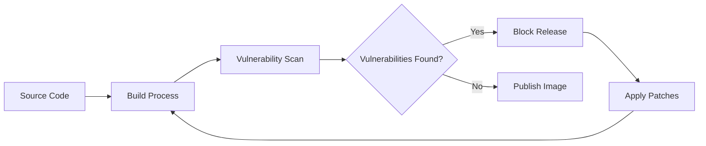

# Vulnerability Management

Chainguard Images are built with security as the top priority. This guide explains how we identify, track, and remediate security vulnerabilities to keep your applications safe.

## Overview

Traditional container images often contain hundreds of known vulnerabilities (CVEs). Chainguard Images start with **zero known vulnerabilities** and maintain this standard through automated processes.

### Key Statistics

- 🔒 **Zero Known CVEs**: All images start with 0 known vulnerabilities
- ⚡ **Fast Response**: Critical vulnerabilities patched within 24 hours
- 🔄 **Nightly Rebuilds**: Images rebuilt daily with latest patches
- 📊 **Continuous Scanning**: Real-time vulnerability detection

## Vulnerability Scanning Process

### 1. Continuous Monitoring

We continuously monitor multiple vulnerability databases:

- **NVD (National Vulnerability Database)**
- **OSV (Open Source Vulnerabilities)**  
- **GitHub Security Advisories**
- **Vendor-specific security feeds**
- **Private security research**

### 2. Automated Detection

Our scanning pipeline includes:



### 3. Multi-Layer Scanning

We scan at multiple levels:

- **Source packages**: Before image build
- **Container layers**: During build process  
- **Final images**: Post-build verification
- **Registry images**: Ongoing monitoring

## Vulnerability Response

### Severity Classification

We follow the CVSS (Common Vulnerability Scoring System) standard:

| Severity | CVSS Score | Response Time | Action |
|----------|------------|---------------|--------|
| 🔴 **Critical** | 9.0 - 10.0 | < 4 hours | Immediate patch & rebuild |
| 🟠 **High** | 7.0 - 8.9 | < 24 hours | Priority patch & rebuild |
| 🟡 **Medium** | 4.0 - 6.9 | < 7 days | Scheduled patch in next release |
| 🟢 **Low** | 0.1 - 3.9 | < 30 days | Included in regular updates |

### Response Workflow

1. **Detection**: Vulnerability identified through scanning
2. **Assessment**: Security team evaluates impact and exploitability
3. **Patching**: Upstream patches applied or workarounds implemented
4. **Testing**: Automated and manual testing of fixes
5. **Release**: New image version published
6. **Notification**: Users notified through multiple channels

## Zero-Day Protection

### Minimal Attack Surface

Our distroless approach provides inherent protection:

- ❌ **No package managers** (apt, yum, etc.)
- ❌ **No shell access** (bash, sh)
- ❌ **No unnecessary utilities**
- ❌ **No debug tools**
- ✅ **Only essential runtime components**

### Example: Attack Surface Comparison

```bash
# Traditional Ubuntu-based Node.js image
$ docker run -it node:18 bash
root@container:/# apt list --installed | wc -l
345 packages installed

# Chainguard Node.js image  
$ docker run -it cgr.dev/chainguard/node:18 sh
docker: Error response: No shell available
# Only ~20 essential packages included
```

## Vulnerability Reporting

### Reading Vulnerability Reports

Each image includes detailed vulnerability information:

```bash
# Using docker scout (if available)
docker scout cves cgr.dev/chainguard/node:latest

# Using grype
grype cgr.dev/chainguard/node:latest

# Using trivy
trivy image cgr.dev/chainguard/node:latest
```

### Sample Vulnerability Report

```
IMAGE: cgr.dev/chainguard/node:latest
SCAN DATE: 2024-01-15 10:30:00 UTC

VULNERABILITY SUMMARY:
┌─────────────┬───────┐
│ SEVERITY    │ COUNT │
├─────────────┼───────┤
│ Critical    │   0   │
│ High        │   0   │ 
│ Medium      │   0   │
│ Low         │   0   │
│ Negligible  │   2   │
└─────────────┴───────┘

TOTAL: 0 vulnerabilities found
```

## Tracking and Updates

### Image Versioning

We use semantic versioning with security indicators:

```
cgr.dev/chainguard/node:18.17.1-20240115
                         │    │      │
                         │    │      └── Build date
                         │    └────────── Patch version
                         └─────────────── Major.minor version
```

### Update Notifications

Stay informed about security updates:

1. **GitHub Releases**: [chainguard-images/images](https://github.com/chainguard-images/images/releases)
2. **RSS Feed**: Subscribe to our security feed
3. **Webhooks**: Automated notifications for CI/CD
4. **Slack/Discord**: Community channels

### Automated Updates

Set up automated image updates in your CI/CD:

```yaml
# GitHub Actions example
name: Update Base Images
on:
  schedule:
    - cron: '0 2 * * *'  # Daily at 2 AM

jobs:
  update:
    runs-on: ubuntu-latest
    steps:
    - name: Check for image updates
      run: |
        CURRENT=$(docker inspect cgr.dev/chainguard/node:latest --format '{{.Id}}')
        docker pull cgr.dev/chainguard/node:latest
        NEW=$(docker inspect cgr.dev/chainguard/node:latest --format '{{.Id}}')
        
        if [ "$CURRENT" != "$NEW" ]; then
          echo "Image updated, rebuilding application..."
          # Trigger rebuild
        fi
```

## Security Best Practices

### 1. Use Specific Tags

```bash
# ❌ Avoid
FROM cgr.dev/chainguard/node:latest

# ✅ Better  
FROM cgr.dev/chainguard/node:18.17.1

# ✅ Best (with build date)
FROM cgr.dev/chainguard/node:18.17.1-20240115
```

### 2. Regular Image Updates

```dockerfile
# Set up automated dependency updates
FROM cgr.dev/chainguard/node:18.17.1

# Use .dockerignore to minimize context
COPY package*.json ./
RUN npm ci --only=production

COPY src/ ./src/
USER nonroot
CMD ["node", "src/index.js"]
```

### 3. Runtime Security

```yaml
# Kubernetes security context
securityContext:
  runAsNonRoot: true
  runAsUser: 65532  # nonroot user
  capabilities:
    drop:
    - ALL
  readOnlyRootFilesystem: true
  allowPrivilegeEscalation: false
```

### 4. Vulnerability Scanning in CI

```yaml
# Add to your CI pipeline
- name: Scan for vulnerabilities
  run: |
    docker build -t myapp:${{ github.sha }} .
    grype myapp:${{ github.sha }} --fail-on high
```

## Compliance and Reporting

### Compliance Standards

Our vulnerability management meets:

- **SOC 2 Type II** requirements
- **ISO 27001** standards  
- **NIST Cybersecurity Framework**
- **SLSA Level 3** supply chain security

### Audit Reports

Generate compliance reports:

```bash
# Generate SBOM with vulnerability data
syft cgr.dev/chainguard/node:latest -o json > sbom.json

# Generate vulnerability report
grype sbom:sbom.json -o json > vulnerabilities.json

# Generate compliance report
cosign verify-attestation cgr.dev/chainguard/node:latest
```

## Emergency Response

### Critical Vulnerability Response

In case of critical vulnerabilities (Log4j, Heartbleed level):

1. **Immediate Assessment**: < 1 hour
2. **Impact Analysis**: < 2 hours  
3. **Patch Development**: < 4 hours
4. **Testing & Release**: < 6 hours
5. **User Notification**: Immediate

### Communication Channels

- **Security Advisories**: GitHub Security tab
- **Emergency Alerts**: Email notifications
- **Status Page**: Real-time incident updates
- **Community Chat**: Slack/Discord announcements

## FAQ

### Q: How often are images scanned?
**A**: Continuously. We scan every commit, every build, and monitor published images 24/7.

### Q: What if a vulnerability has no available patch?
**A**: We implement mitigations, provide workarounds, or temporarily remove affected components until patches are available.

### Q: Can I get notifications for specific images?
**A**: Yes, use our webhook system or monitor our GitHub releases for specific image updates.

### Q: How do you handle false positives?
**A**: Our security team manually reviews all findings. False positives are documented and excluded from future scans.

### Q: What scanning tools do you use?
**A**: We use multiple tools including Grype, Trivy, and proprietary scanners for comprehensive coverage.

## Support

For security-related questions:

- 🔒 **Security Issues**: [security@chainguard.dev](mailto:security@chainguard.dev)
- 🐛 **Bug Reports**: [GitHub Issues](https://github.com/chainguard-images/images/issues)
- 💬 **General Questions**: [GitHub Discussions](https://github.com/chainguard-images/images/discussions)
- 📞 **Enterprise Support**: Contact your account manager

---

*Chainguard Images: Secure by default, updated continuously.* 🛡️